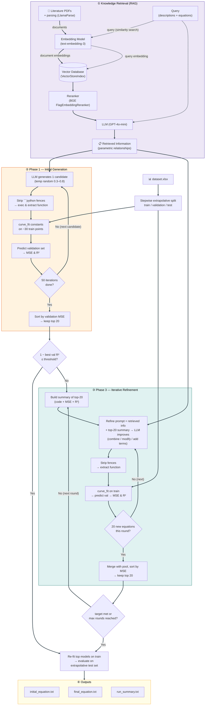

# Knowledge to analytical model for manufacturing processes

> Developed by the **Computational Engineering and Design (CEaD) Laboratory**,
> directed by **Dr. Hongyi Xu** — <https://hongyixu.lab.uconn.edu>

LLM-driven **extrapolative modelling of manufacturing processes**. The pipeline
mines parametric relationships from the scientific literature (Retrieval-
Augmented Generation), proposes candidate equations with a large language model,
fits them to a small experimental dataset, and iteratively refines them until
they generalise to an unseen, high-value (extrapolative) test region.


This repository is based on our journal paper *"Large Language Models for
Extrapolative Modeling of Manufacturing Processes"* (Naghavi Khanghah et al.),
published in the *Journal of Intelligent Manufacturing* (2026),
[doi:10.1007/s10845-025-02638-w](https://doi.org/10.1007/s10845-025-02638-w). A
preprint is also available in this repository:
[`paper/Knowledge-to-analytical-model-manufacturing-process.pdf`](paper/Knowledge-to-analytical-model-manufacturing-process.pdf).
See [Citation](#citation) for the full reference.

### Authors & collaborators

Kiarash Naghavi Khanghah¹, Anandkumar Patel², Rajiv Malhotra²\*, Hongyi Xu¹\*

¹ School of Mechanical, Aerospace and Manufacturing Engineering, University of
Connecticut, Storrs, CT 06269
² Department of Mechanical & Aerospace Engineering, Rutgers, the State University
of New Jersey, Piscataway, NJ 08854

---

## Methodology

This work introduces an **LLM-based framework for extrapolative modeling of
manufacturing processes** — i.e. for discovering the analytical relationship
between *process parameters* (inputs) and *performance metrics* (outputs), and
having that relationship stay accurate **outside** the range of data it was
trained on.

### The problem it solves

There are two classical ways to model a manufacturing process, and each has a
weakness:

| Approach | How it works | Limitation |
| --- | --- | --- |
| **Physics-based modeling** | A human reads the literature and derives governing equations. | Slow, trial-and-error, and **subjective** — different experts produce different models. |
| **Machine Learning** | A neural net / regressor learns input→output from data. | Needs **lots of data**, is a **black box**, and **extrapolates poorly** beyond the training range. |

The key insight of this paper is to **combine the two**: use a Large Language
Model to automatically *read the literature* (removing the human-interpretation
bottleneck) and to *iteratively refine* equations against a **small** dataset
(removing the data-hunger of pure ML). The resulting models are **analytical**
(interpretable) yet **data-tuned**, and they **extrapolate** far
better than conventional ML trained on the same small budget.

### The two components

**1. Knowledge Retrieval (RAG).** Research PDFs related to the process are
parsed with **LlamaParse** into manageable markdown chunks. Both sides are
embedded into the **same vector space** with OpenAI `text-embedding-3`: the
document chunks are embedded once and stored in a vector index, and at query
time the **query itself is also embedded** so it can be compared against them.
For the process of interest, the embedded query runs a **similarity search**,
the top-*k* chunks are **re-ranked** (BGE reranker), and an LLM
(**GPT-4o-mini**) distills them into a statement of the parametric
relationships. Two query forms are used:

- **Query Form 1 — descriptions:** retrieve *qualitative* relationships (e.g.
  "output A increases quadratically with input B").
- **Query Form 2 — equations:** retrieve any *explicit equations* already
  present in the literature, then fall back to descriptions.

This dual-query design defines the two main scenarios studied in the paper:
**`ctx`** (descriptions only) and **`Eq+ctx`** (equations *plus* descriptions).

**2. Model Generation + Iterative Refinement.** The retrieved knowledge is
combined with a prompt instructing the LLM to turn it into **Python equation
functions** — and explicitly *not* to rely on its own general knowledge.

- **Phase 1 — initial generation:** the LLM proposes **50 candidate equations**
  (functional forms only), using a randomized temperature between **0.3–0.8** to
  encourage diversity. Each candidate's constants are fitted to **~30 training
  points** with `scipy.optimize.curve_fit`, then scored on a validation set by
  **R²** and **MSE**. The **top 20** are kept. If any reaches the success
  criterion (**validation error < 2%**, i.e. `1 − R² ≤ threshold`), it is
  selected and the run stops.
- **Phase 3 — refinement:** if the criterion is not met, the top-20 equations
  and their R² scores are fed *back* to the LLM with an instruction to improve
  them (algebraic manipulation, combining/introducing terms). Each round
  generates **20 new equations**, re-fits, re-scores, and updates the top-20.
  This repeats until the R² target is met or the round budget runs out.

> The Phase 1 / Phase 3 naming in the code mirrors these two stages of the paper
> (Phase 2 — knowledge retrieval — runs once before them).

### The extrapolation protocol

To genuinely test extrapolation, the data is split with a **stepwise filtering**
strategy rather than a random split: for each input variable in turn, the
**lowest 75%** of its values stay in the train/validation pool and the **highest
25%** is pushed into the **test set**. The result:

- **Validation set** shares the *same range* as training → measures
  **interpolation**.
- **Test set** lies *outside* the training range → measures **extrapolation**.

Train/validation sets are kept deliberately **small** (≈30 train, ≈51 val) to
mimic real industrial data scarcity, while the test set is large (≈175 points)
for a robust extrapolation assessment.

### Validation: three testbeds & headline results

The framework was evaluated on three mechanistically distinct processes:

| Testbed | Principle | Inputs → Outputs |
| --- | --- | --- |
| **FLIPMM** (Flow-assisted Laser-Induced Plasma Micro-Machining) | Subtractive | laser energy, frequency, scanning speed, water speed → channel width, depth, MRR, HAZ |
| **TADCR** (Turn-Assisted Deep Cold Rolling) | Deformation | rolling force, ball diameter, initial roughness, passes → hardness, roughness |
| **MSLA** (Masked Stereolithography) | Additive | layer thickness, exposure time, build orientation → printing time, ultimate tensile strength |

**Key findings:**

- **`Eq+ctx` > `ctx`-Refined > `ctx`-Initial** on extrapolative accuracy —
  retrieving *equations* from the literature gives the best starting point, and
  refinement closes much of the gap when only descriptions are available.
- **Refinement matters:** e.g. for FLIPMM Heat-Affected-Zone, refinement lifted
  the extrapolative test R² from **0.689 → 0.928**; for MSLA printing time, from
  **0.35 → 0.835**.
- **Beats conventional ML on the same small budget:** the framework consistently
  outperformed SVR (often negative R²) and RFR, matched or beat GPR, and beat
  symbolic regression (PySR) — *while remaining interpretable*.

---

## What it does



1. **Knowledge extraction** — the literature PDFs are parsed (LlamaParse),
   indexed (LlamaIndex + OpenAI embeddings + a BGE reranker), and queried for the
   relationships between the input variables and the target metric.
2. **Dataset split** — the spreadsheet is split into a low-value
   train/validation pool and a held-out **extrapolative** test set.
3. **Phase 1 (initial)** — the LLM proposes Python equation functions from the
   retrieved knowledge; each is fitted with `scipy.optimize.curve_fit` and scored
   by validation MSE / R².
4. **Phase 3 (refinement)** — the best equations are fed back to the LLM, which
   proposes improvements, repeating until `(1 − validation R²) ≤ r2_threshold`
   or the round budget is exhausted.
5. **Outputs** — the best initial and final equations (with validation and test
   metrics) are written as text files.

---

## Project layout

```
KnowledgeToEquation/
├── main.py                     # CLI entry point: runs the full pipeline
├── requirements.txt
├── config/
│   ├── config.yaml             # ALL process-specific settings (edit this)
│   ├── .env                    # API keys (git-ignored)
│   └── .env.example            # template for .env
├── data/
│   ├── <dataset>.xlsx          # your experimental data (git-ignored)
│   ├── literature/             # source PDFs for knowledge extraction
│   └── cache/                  # cached PDF parse (auto-generated)
├── output/                     # generated equations & summary (auto-created)
├── src/
│   ├── config_loader.py        # loads config.yaml + .env
│   ├── knowledge.py            # RAG: parse + index + retrieve
│   ├── dataset.py              # load spreadsheet + extrapolative split
│   ├── modeling.py             # Phase 1 / Phase 3 generation, fitting, testing
│   └── pipeline.py             # orchestration + writing output files
└── details.ipynb              # original notebook (reference)
    playground.ipynb            # step-by-step interactive playground
```

The Python package (`src/` + `main.py`) is the **reproducible, Git-ready**
pipeline. The notebooks are **playgrounds** for inspecting each step
interactively — they call the same `src` functions, so they never drift from the
production code.

---

## Setup

```bash
# 1. Install dependencies (tested with Python 3.10.8)
pip install -r requirements.txt

# 2. Add your API keys
cp config/.env.example config/.env
#   then edit config/.env and set OPENAI_API_KEY and LLAMA_CLOUD_API_KEY

# 3. Add your data
#   - put the dataset spreadsheet in data/
#   - put the literature PDFs in data/literature/
```

---

## Configure for your process

Everything process-specific lives in [`config/config.yaml`](config/config.yaml) —
**no Python edits are needed** to switch processes. The most important sections:

| Section            | What to set                                                            |
| ------------------ | ---------------------------------------------------------------------- |
| `topic`            | One-line description of the quantity you are modelling.                |
| `variables.inputs` | Each input's `name`, `symbol` (used in the generated code) and dataset `column`. **Order matters** — it is the order the equation unpacks `X`. |
| `variables.output` | The target metric's `name`, `symbol` and `column`.                     |
| `dataset`          | Spreadsheet path, the split `ratio`, `train_size`, `random_state`.     |
| `knowledge`        | The literature PDF list, parsing instruction and retrieval query.      |
| `model`            | LLM model, iteration counts, refinement rounds and the R² threshold.   |
| `output`           | Output directory and the three result file names.                      |

The input/output **symbols** flow straight into the prompts, so a generated
function for the default config looks like:

```python
def model(X, a0, a1, ...):
    WS, P, F, SS = X      # symbols + order come from variables.inputs
    MRR = ...             # symbol comes from variables.output
    return MRR
```

---

## Run

```bash
python main.py                      # uses config/config.yaml
python main.py --config my.yaml     # uses a custom config
```

### Outputs (in `output/`)

| File                    | Contents                                                       |
| ----------------------- | -------------------------------------------------------------- |
| `initial_equation.txt`  | Best **Phase 1** equation + validation & test metrics.         |
| `final_equation.txt`    | Best **refined** equation + validation & test metrics.         |
| `run_summary.txt`       | Top models from both phases plus the full test breakdown.      |

File names are configurable under `output:` in the config.

---

## Interactive playground

Open [`playground.ipynb`](playground.ipynb) to run the pipeline step by step —
inspect the retrieved knowledge, the data split, the generated equations and the
metrics as they are produced. It imports the same `src` modules used by
`main.py`. `details.ipynb` is the original, pre-refactor notebook,
kept for reference.

---

## Notes

- **Cost & time.** Each Phase 1/Phase 3 iteration calls the LLM (and the RAG
  query). Reduce `model.phase1_iterations` / `model.phase3_iterations` while
  experimenting.
- **PDF parse cache.** Parsed PDFs are cached at `data/cache/parsed_data.pkl`.
  Delete it after changing the literature PDFs.
- **Secrets.** `config/.env` is git-ignored — never commit your API keys.

---

## Citation

If you use this work, please cite:

> Naghavi Khanghah, K., Patel, A., Malhotra, R. et al. Large language models for
> extrapolative modeling of manufacturing processes. *J Intell Manuf* **37**,
> 2085–2113 (2026). https://doi.org/10.1007/s10845-025-02638-w

```bibtex
@article{NaghaviKhanghah2026,
  title   = {Large language models for extrapolative modeling of manufacturing processes},
  author  = {Naghavi Khanghah, Kiarash and Patel, Anandkumar and Malhotra, Rajiv and Xu, Hongyi},
  journal = {Journal of Intelligent Manufacturing},
  volume  = {37},
  pages   = {2085--2113},
  year    = {2026},
  doi     = {10.1007/s10845-025-02638-w}
}
```

A preprint PDF is included at
[`paper/Knowledge-to-analytical-model-manufacturing-process.pdf`](paper/Knowledge-to-analytical-model-manufacturing-process.pdf).

---

> **Coded by KNK.**
> This work has been enhanced for readability and tutorial format by Claude Opus 4.6.
